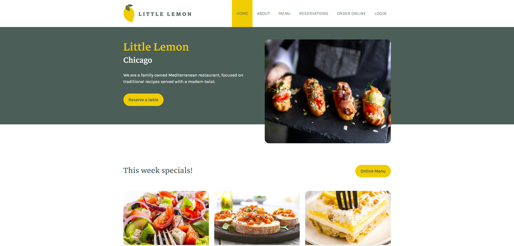
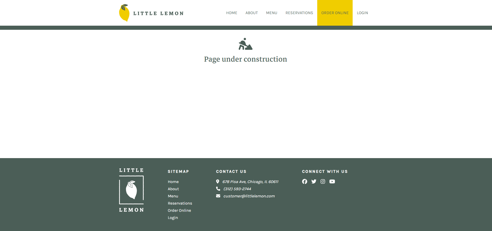
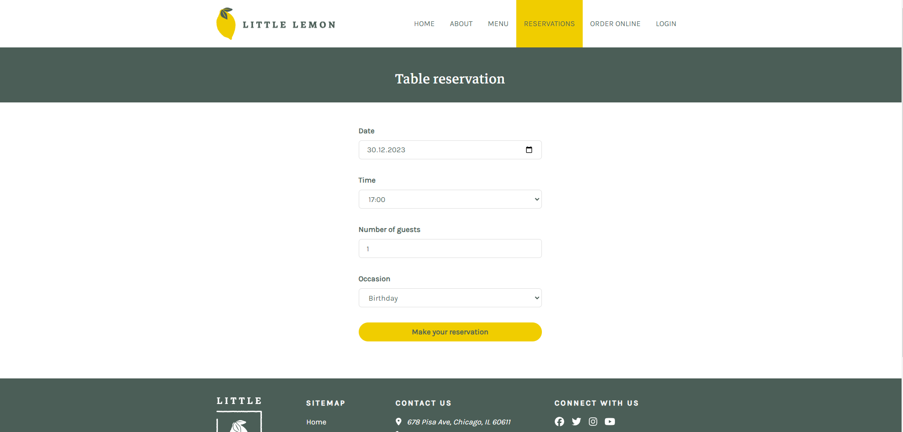

#Little Lemon Restaurant Frontend Documentation

## Overview
Welcome to the documentation for the frontend of the Little Lemon Restaurant project. This React-based application is designed to provide users with a user-friendly interface for exploring the restaurant's menu, placing orders online, and making reservations. Please note that certain sections of the application are currently under construction.

The little lemon app is the capstone project for Meta's Front-End Developer Certificate on Coursera.

## Table of contents
1. [Getting Started](#getting-started)
  * [Prerequisites](#prerequisites)
  * [Installation](#installation)
2. [Project Structure](#project-structure)
3. [Views](#views)
  * [Home](#home)
  * [About](#about)
  * [Menu](#menu)
  * [Order online](#order-online)
  * [Login](#login)
  * [Reservations](#reservations)
4. [Under Contruction](#under-construction)
   * [About](#about)
   * [Menu](#menu)
   * [Order online](#order-online)
5. [Reservations](#reservations)
  * [Making a Reservation](#making-a-reservation)
6. [Fake API](#fake-api)

## Getting Started
 ## Prerequisites
Make sure you have Node.js and npm installed on your machine.
 ## Installation
 1. Clone the repository.
    `git clone https://github.com/KrystianSzychx/little-lemon-frontend.git`
 2. Navigate to the project directory. `cd my-app`
 3. Install dependencies. `npm install`

## Project Structure  
The frontend is built using React and organized as follows  
my-app  
<pre> |-- src  
    |-- components   
      |-- layout  
        |-- assets  
        |-- Footer.css  
        |-- Footer.js  
        |-- Header.css  
        |-- Header.js  
        |-- Layout.js  
      |--pages  
        |-- Bookings  
        |-- Home  
        |-- NotFound  
        |-- UnderConstruction  
    |-- utils  
      |-- fakeAPI.js  
      |-- pages.js  
    |-- App.js   
    |-- index.js   
    |-- index.css   
    |-- reportWebVitals.js   </pre>

## Views
### Home
The Home view displays an overview of the Little Lemon Restaurant.
 
### About
The About view provides information about the restaurant.
### Menu
The Menu view showcases the restaurant's menu.
### Order Online
The Order Online view allows users to place orders online.
### Login
The Login view provides user authentication.
### Resevations
The Reservations view enables users to make reservations.

## Under Construction
### About (Under Construction)
The About view is currently under construction.
### Menu (Under Construction)
The Menu view is currently under construction.
### Order Online (Under Construction)
The Menu view is currently under construction.

## Reservations
### Making a Reservation
Users can make reservations by navigating to the Reservations view and selecting by Date, Time, Number of guests and Occasion.

## Fake API
The application uses a fake API to simulate data.
